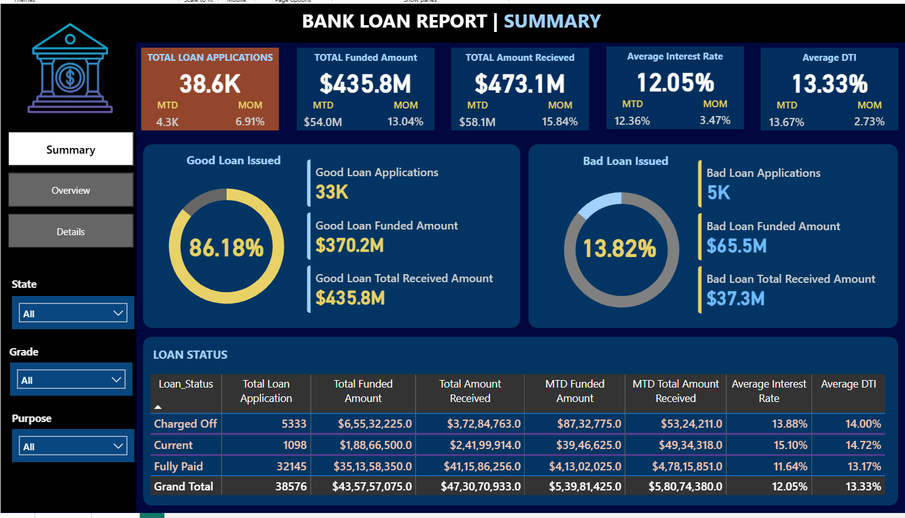

# Bank Loan Analysis Dashboard

A Power BI portfolio project that analyzes bank loan applications,
funded amounts, repayments, borrower characteristics, and loan performance.

## Project Overview

This dashboard helps stakeholders monitor:

- Total loan applications
- Total funded amount
- Total amount received
- Average interest rate
- Average debt-to-income ratio
- Good and bad loan performance
- Monthly and regional loan trends

## Tools Used

- Power BI
- SQL
- Microsoft Excel
- Power Query
- DAX

## Dashboard Preview

## Repository Structure

- `powerbi/` – Power BI dashboard file
- `sql/` – SQL queries used for analysis
- `data/` – Project dataset
- `docs/` – Supporting documentation
- `assets/` – Dashboard screenshots

## Data Privacy

The dataset used in this project is anonymized and does not contain
personally identifiable customer information.